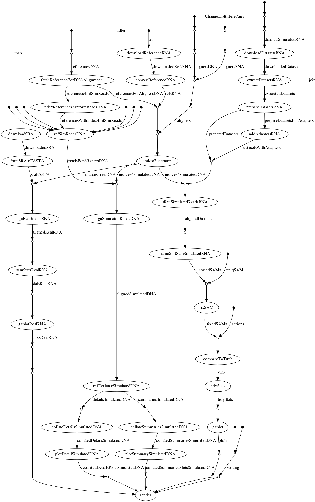

[](https://github.com/csiro-crop-informatics/repset/releases)
[](https://github.com/csiro-crop-informatics/repset/releases)
[](https://www.nextflow.io/)

*REPSET* or *RREPSET* or *R²EPSET* is a *R*eproducible, *R*eusable, *E*xtensible, *P*ortable and *S*calable *E*valuation *T*ool for short read aligners

# Table of Contents <!-- omit in toc -->
- [Dependencies](#dependencies)
- [Preliminaries](#preliminaries)
  - [Note on terminology (mapping vs alignment)](#note-on-terminology-mapping-vs-alignment)
- [Running the pipeline](#running-the-pipeline)
  - [Execution profiles](#execution-profiles)
    - [Running with docker](#running-with-docker)
    - [Running with singularity (local or Slurm cluster)](#running-with-singularity-local-or-slurm-cluster)
    - [Running on AWS batch](#running-on-aws-batch)
  - [Mapping modes](#mapping-modes)
  - [Evaluated mappers](#evaluated-mappers)
  - [Alternative input data sets](#alternative-input-data-sets)
- [Computational resources](#computational-resources)
- [Capturing results and run metadata](#capturing-results-and-run-metadata)
- [Experimental pipeline overview](#experimental-pipeline-overview)
- [Execution environment](#execution-environment)
- [Adding another mapper](#adding-another-mapper)
    - [Template variables](#template-variables)
      - [Indexing](#indexing)
      - [Mapping](#mapping)
    - [Separate template files (optional)](#separate-template-files-optional)
  - [Non-core mapping parameters (optional)](#non-core-mapping-parameters-optional)
  - [Notes on container specification in `conf/mappers.config`](#notes-on-container-specification-in-confmappersconfig)
- [Per-tool container images and docker automated builds](#per-tool-container-images-and-docker-automated-builds)
  - [Setting-up an automated build](#setting-up-an-automated-build)
  - [Adding or updating a Dockerfile](#adding-or-updating-a-dockerfile)
- [Report](#report)
  - [Rendering outside the pipeline](#rendering-outside-the-pipeline)
    - [Using docker](#using-docker)
    - [Using singularity](#using-singularity)
    - [Natively](#natively)
- [Manuscript](#manuscript)
  - [Rendering](#rendering)
  - [Bibliography](#bibliography)

# Dependencies

* Nextflow [](https://www.nextflow.io/) - you may consider using the exact version of Nextflow by setting the appropriate environmental variable `export NXF_VER=19.10.0` before running the workflow.
* and
  * either Singularity [](https://www.sylabs.io/singularity/)
   * or Docker

# Preliminaries

The pipeline consists of several, partly dependent paths
which facilitate the evaluation of mappers using
either DNA-  or RNA-Seq data, either ~~real~~ (temporarily unavailable) or simulated.
The paths can be executed separately or in a single run.
When running separately or re-running the pipeline
the `-resume` flag ensures that previously computed
results (or partial results) are re-used.

Default execution will simulate, align and evaluate reads from a few small data sets defined in [`conf/simulations.config`](conf/simulations.config).

## Note on terminology (mapping vs alignment)

Terms related to read mapping, alignment and related such as pseudoalignment and quasi mapping are used in bioinformatics inconsistently (which would make many a mathematician cringe).
We hereby attempt to strictly follow this convention by consistently propagating these inconsistencies.

# Running the pipeline

## Execution profiles

There are several ways to execute the pipeline, each requires Nextflow and either Docker or Singularity.
See [nextflow.config](nextflow.config) for available execution profiles (or to add your own!), e.g. for local execution this could be


### Running with docker

```
nextflow run csiro-crop-informatics/repset -profile docker
```

### Running with singularity (local or Slurm cluster)

Tu run the workflow with Singularity on

* a local machine,
* a standalone server
* in an interactive session on a cluster

First make sure that recent version of Singularity is available and then run

```
nextflow run csiro-crop-informatics/repset -profile singularity
```

On a Slurm cluster you can run

```
nextflow run csiro-crop-informatics/repset -profile slurm,singularity
```

Note! Multiple container images will be pulled in parallel from Docker Hub (and potentially other repositories.
A [bug](https://github.com/nextflow-io/nextflow/issues/1210) (?) in singularity may cause the parallel processing to fail with an error message similar to

```
Error executing process > 'indexGenerator ([[species:Saccharomyces_cerevisiae, version:R64-1-1.44, seqtype:DNA], [tool:hisat2, version:2.1.0]])'

Caused by:
  Failed to pull singularity image
  command: singularity pull  --name rsuchecki-hisat2-2.1.0_4cb1d4007322767b562e98f69179e8ebf6d31fb1.img docker://rsuchecki/hisat2:2.1.0_4cb1d4007322767b562e98f69179e8ebf6d31fb1 > /dev/null
  status : 255
```

Until this is [fixed](https://github.com/sylabs/singularity/issues/3634), our workaround is to run the following prior to running the main script, run

```
nextflow run csiro-crop-informatics/repset/pull_containers.nf
```

which will pull most of the containers used by the workflow (the remaining ones are unlikely to be pulled in parallel).

Note that singularity must be available on the node where you execute the pipeline, e.g. by running `module load singularity/3.2.1` prior to running the pipeline.
It is also required on each compute node. Your cluster configuration should ensure that,
if it does not, the additional execution profile `singularitymodule` can be modified in [nextflow.config](nextflow.config) to match your singularity module name and used at run-time.


### Running on AWS batch

If you are new to AWS batch and/or nextflow, follow [this blog post](https://antunderwood.gitlab.io/bioinformant-blog/posts/running_nextflow_on_aws_batch/), once you are done, or you already use AWS batch, simply run

```
nextflow run csiro-crop-informatics/repset \
  -profile awsbatch \
  -work-dir s3://your_s3_bucket/work \
```

after replacing `your_s3_bucket` with a bucket you have created on S3. 

To reduce potential connectivity issues you may consider running the workflow from an EC2 instance. 
This may guide your decision on where the result file(s) should be placed.
If you wish to deposit the result file(s) on `s3`, you can specify e.g. `--outdir s3://your_s3_bucket/results`,
otherwise you can find them under `./results`.


[**Warning! You will be charged by AWS according to your resource use.**](https://docs.aws.amazon.com/awsaccountbilling/latest/aboutv2/monitoring-costs.html)


## Mapping modes

The workflow incorporates three ways of mapping and evaluating reads, `dna2dna`, `rna2rna`, `rna2dna`
and by default all are executed. To restrict execution to one or two of those,
you can run the workflow with e.g.

* `--mapmode dna2dna` - evaluate DNA-Seq read mapping to genome
* `--mapmode rna2rna|rna2dna`  - evaluate RNA-Seq read mapping to genome and transcriptome

## Evaluated mappers

An alignment/mapping tool is included in the evaluation if appropriate templates are included
as specified below in [Adding another mapper](#adding-another-mapper).
To execute the workflow for only a subset of the available tools, you can specify e.g.

* `--mappers star` - only evaluate a single tool
* `--mappers 'bwa|bowtie2|biokanga'` - evaluate a subset of tools
* `--mappers '^((?!bwa).)*$'` - evaluate all but this tool

Other regular expressions can be specified to taylor the list of evaluated tools.

## Alternative input data sets

To run the pipeline with alternative input data you can use the `-params-file` flag
to specify a JSON or a YAML file to overwrite `conf/simulations.config`,
for example 

```
nextflow run main.nf -params-file path/to/conf/simulations.json
```

Alternatively, you can simply edit the content of conf/simulations.config`.

# Computational resources

Resources required for running the workflow can be substantial and will vary greatly
depending on multiple factors, such as
* input genomes sizes
* simulated read coverage
* number and choice of mappers evaluated
* mapping mode(s) selected

We have empirically derived simple functions to allow resource requests
auto-scaling for key processes such as genome indexing and read mapping.
These depend on either the reference size or the number of reads and
were based on tools which were slowest or required the most memory.
Clearly if e.g. a slower tool is added, these will need to be revised.
However, failed tasks are re-submitted with increased resources as long as
valid comparisons can be made between different tools' results.
For that reason, CPUs and memory limits are not increased on re-submission
of the mapping process but the maximum allowed wall-clock time is.
In the case of the indexing process, the initial time and memory limits
are increased on each task re-submission as indexing performance is not
well suited for comparisons anyway. For example, many indexing processes
are single-threaded, in other cases it might make sense to skip the indexing
process and allow for on-the-fly index generation.
Resource auto-scaling 
is subject to constraints which may need to be adjusted for particular
compute environment either at run time (e.g.  `--max_memory 64.GB --max_cpus 32 --max_time 72.h`)
or by editing (`conf/requirements.config`)[conf/requirements.config]
where the dynamic scaling functions can also be adjusted.


# Capturing results and run metadata

Each pipeline run generates a number of files including
* results in the form of report, figures, tables etc.
* run metadata reflecting information about the pipeline version, software and compute environment etc.

These can be simply collected from the output directories but for full traceability of the results, the following procedure is preferable:

1. Fork this repository
2. (Optional) select a tagged revision or add a tag (adhering to the usual semantic versioning approach) 
3. Generate a [Git Hub access token](https://help.github.com/en/articles/creating-a-personal-access-token-for-the-command-line)
   which will allow the pipeline to create releases in your forked repset repository,
   when creating the token it should suffice to select only the following scope:
   > `public_repo`   Access public repositories
   
   (assuming your fork of repset remains public)

4. Make the access token accessible as an environmental variable 
5. Run the pipeline from the remote repository, specifying
    - the `--release` flag
    - the appropriate `-profile` 
    - the intended revision e.g. `-revision v0.9.10` (optional)


For example, 

```
GH_TOKEN='your-token-goes-here' nextflow run \
  user-or-organisation-name/repset-fork-name \
  -profile singularity \
  -revision v0.9.10 \
  --release \
```

On successful completion of the pipeline a series of API calls will be made to

1. create a new release
2. upload results and metadata files as artefacts for that release
3. finalize the release (skipped if `--draft` flag used)

The last of this calls will trigger minting of a DOI for that release if Zenodo integration is configured and enabled for the repository.
To keep your release as a draft use the `--draft` flag.

# Experimental pipeline overview

<!--  -->
<!--  -->

<!-- For comparison, here is [an earlier version of this graph](figures/dag-old-colmplex.png) -  before indexing and alignment processes were generalised to work with multiple tools. This earlier workflow also excludes evaluation based on real RNA-Seq data. -->

# Execution environment

Execution environment is captured in `runmeta.json`.

# Adding another mapper

A mapper may be included for any or all of the mapping modes (`dna2dna, rna2dna, rna2rna`).
In each case the same indexing template will be used.

After you have cloned this repository **add another entry in [`conf/mappers.config`](conf/mappers.config)**, under

```
params {
  mappersDefinitions = [
    //insert here
  ]
}
```

For example, to add a hypothetical `my_mapper` version `1.0` you might add the following:

```groovy
[
  tool: 'my_mapper',
  version: '1.0',
  container: 'path/to/docker/repository/my_mapper:1.0',
  index: 'my_mapper index --input-fasta ${ref} --output-index ${ref}.idx',
  dna2dna:
  '''
  my_mapper align --index ${ref} \
  -1 ${reads[0]} -2 ${reads[1]} \
  --threads ${task.cpus} \
  ${ALIGN_PARAMS} > out.sam
  '''
],
```

Additional script templates can be added for `rna2rna` and `rna2dna` mapping modes.
Script templates must be wrapped in either single (`'script'`) or triple single (`'''script'''`) quotes.
If you would rather keep the templates in separate files follow [these instructions](#separate-template-files-optional).

### Template variables

Applicable **nextflow** (not bash!) variables resolve as follows:

#### Indexing

* `${task.cpus}` - number of cpu threads available to the indexing process
* `${ref}` - the reference FASTA filename - we use it both to specify the input file and the basename of the generated index

#### Mapping

* `${task.cpus}` - number of logical cpus available to the alignment process
* `${ref}` - basename of the index file (sufficient if aligner uses basename to find multi-file index, otherwise appropriate extension may need to be appended, e.g. `${ref}.idx`).
* `${reads[0]}` and `${reads[1]}` - filenames of paired-end reads
* `${ALIGN_PARAMS}` any additional params passed to the aligner
  * Empty by default but one or more sets of params can be defined in [conf/mapping_params.config](conf/mapping_params.config). When multiple sets of params are specified each set is used in separate execution.


### Separate template files (optional)

If you would rather keep the templates in separate files rather than embedded in [`conf/mappers.config`](conf/mappers.config)
you can place each file under the appropriate template directory:

  * [`templates/index`](templates/index)
  * [`templates/dna2dna`](templates/dna2dna)
  * [`templates/rna2dna`](templates/rna2dna)
  * [`templates/rna2rna`](templates/rna2rna)

and instead of including the script template string directly in [`conf/mappers.config`](conf/mappers.config) as we did above, set

* `rna2dna: true,` which will be resolved to `templates/rna2dna/my_mapper.sh`

or, when using a different file name,

* `rna2dna: 'foo_bar.sh',` which will be resolved to `templates/rna2dna/foo_bar.sh`

See the header of [`conf/mappers.config`](conf/mappers.config) for more details and limitations.


## Non-core mapping parameters (optional)

Add one or more sets of mapping parameters to [conf/mapping_params.config](conf/mapping_params.config),
this is meant for parameter space exploration and should include any fine tuning params while the template
should only include core params essential to mapper execution.


## Notes on container specification in `conf/mappers.config`

You can upload a relevant container image to a docker registry (such as Docker Hub) or locate an existing one [e.g. among  quay biocontainers](https://quay.io/organization/biocontainers). If you opt for an existing one, chose one with a specific version tag and a Dockerfile.
Alternatively, follow our procedure below for [defining per-tool container images and docker automated builds](#per-tool-container-images-and-docker-automated-builds)


We opt for Docker containers which can also be executed using Singularity.
Container images are pulled from Docker Hub, but nextflow is able to access other registries and also local images, see relevant [nextflow documentation](https://www.nextflow.io/docs/latest/singularity.html#singularity-docker-hub)

# Per-tool container images and docker automated builds

Dockerfiles for individual tools used can be found under `dockerfiles/`.
This includes various mappers but also other tools used by the pipeline.
For each tool (or tool-set) we created a docker hub/cloud repository and configured automated builds.

## Setting-up an automated build

Builds can be triggered from branches ~~and tags~~.

The following approach relies on creating a branch for a specific version of a tool.
~~The same can be achieved by simply tagging the relevant commit, but this may result in proliferation of tags while branches can be merged into master and deleted while preserving the history.~~
~~If you'd rather use tags, in (2) change the 'Source type' below to 'Tag' and later tag an appropriate commit using `docker/tool/version` pattern rather than committing to a dedicated branch.~~ (tags can be problematic - if tag is based on version of a tool and container needs to be updated, tags may have to be removed/re-added)

1. Create [Docker Cloud](https://cloud.docker.com/) repo for your tool - *do not link to specific GitHub repo or configure automated build at this stage*, but only *after* it has been created - otherwise the tags for containers built later may be malformed.
2. Link the created a [Docker Cloud](https://cloud.docker.com/) repo with this GitHub repo (go to Builds -> Configure Automated Builds)
3. Add an automated build rule (replace `tool` with the name of the tool).

| Source type   | Source                   | Docker Tag  | Dockerfile location | Build Context  |
| ------------- | ------------------------ | ----------- | ------------------- | -------------- |
| Branch        | `/^docker\/tool\/(.*)$/` | `{\1}`      | `tool.Dockerfile`   | `/dockerfiles` |


## Adding or updating a Dockerfile

Checkout a new branch replacing `tool` and `version` with the intended tool name and version, respectively.
For example,

```
tool='bwa'
version='0.7.17'
```

```
git checkout -b docker/${tool}/${version}
```

Add, create or modify `dockerfiles/${tool}.Dockerfile` as required.

Commit and push to trigger an automated build

```
git add dockerfiles/${tool}.Dockerfile
git commit
git push --set-upstream origin docker/${tool}/${version}
```

This should trigger an automated build in the linked Docker Hub/cloud repository.

In case the automated build is not triggered for a newly created Docker repo, it may help to delete the Docker repo and repeat steps 1-3 above. Then push some innocuous change to the branch to trigger the build.

If everything works as intended, you may update [conf/containers.config](conf/containers.config) to the new tool version.


Then either create a PR to merge the new branch into master or,
if you have write permissions for this repository or working on your fork of it, checkout master and merge.

```
git checkout master
git merge docker/${tool}/${version}
```

# Report

TODO: add information on

* how to edit the report template
* how the final report gets generated

If report template is sufficiently generic we will be able to easily render to html and PDF, otherwise we should settle for HTML(?).

Rendering of the report constitutes the final step of the pipeline and relies on a container defined in [`dockerfiles/renderer.Dockerfile`](dockerfiles/renderer.Dockerfile) for rendering environment.

## Rendering outside the pipeline

There are several ways for rendering of the report outside the pipeline, with docker being the preferred option.

### Using docker

1. Put all requited files in one place

```sh
mkdir -p localrender
cp report/report.Rmd  localrender/
cp results/* localrender/
cp flowinfo/*.{json,tsv} localrender/
```

2. Docker run rendering

```sh
docker run \
  --rm \
  --user $(id -u):$(id -g) \
  --volume $(pwd)/localrender:/render \
  --volume $(pwd)/bin:/binr \
  --workdir /render \
  rsuchecki/renderer:0.4.1_81ab6b5d71509d48e3a37b5eafb4bca5b117b5fc /binr/render.R
```

3. Rendered report should be available under `./localrender`
   

### Using singularity

1. Put all requited files in one place

```sh
mkdir -p localrender \
 && cp report/report.Rmd  localrender/ \
 && cp results/* localrender/ \
 && cp flowinfo/*.{json,tsv} localrender/ 
```

2. Docker run rendering
  
```sh
singularity exec \
  --bind $(pwd)/bin:/binr \
  --pwd $(pwd)/localrender \
  docker://rsuchecki/renderer:0.4.1_81ab6b5d71509d48e3a37b5eafb4bca5b117b5fc /binr/render.R
```

3. Rendered report should be available under `./localrender`

### Natively

If you'd like to render the report without docker/singularity, you will need the following:

* `R` e.g. on ubuntu `sudo apt apt install r-base-core`
* `pandoc` e.g. on ubuntu `sudo apt install pandoc pandoc-citeproc`
* `LaTeX` e.g. on ubuntu `sudo apt install texlive texlive-latex-extra`
* `R` packages:
  * `rmarkdown`
  * `rticles`
  * `bookdown`
  * `tidyverse`
  * `jsonlite`
  * `kableExtra`

Then:

```
mkdir -p localrender \
 && cp report/report.Rmd  localrender/ \
 && cp results/* localrender/ \
 && cp flowinfo/*.{json,tsv} localrender/ 

cd localrender && ../bin/render.R
```


# Manuscript

Manuscript source is under `manuscript/` sub directory on `manuscript` branch which should not be merged into master.
Application note is drafted in [RMarkdown](https://rmarkdown.rstudio.com/) in [`manuscript/repset.Rmd`](blob/manuscript/manuscript/repset.Rmd) file.
RMarkdown is well integrated in RStudio, but can be written/edited in a text editor of your choice.

## Rendering
The manuscript will be rendered the pipeline is executed while `manuscript` branch is checked out, either
  * locally
  or
  * by specifying `-revision manuscript` at run-time

Appropriate revision of the master branch should first be mnerged into the `manuscript` branch.

The manuscript can be rendered outside the pipeline in a fashion analogous to how this can be done for the [report](#rendering-outside-the-pipeline),
just replace any use of `report` by `manuscript`.


## Bibliography

Among the [alternatives available](https://rmarkdown.rstudio.com/authoring_bibliographies_and_citations.html#specifying_a_bibliography) we opted for BibTeX, see [`writing/references.bib`](writing/references.bib).

